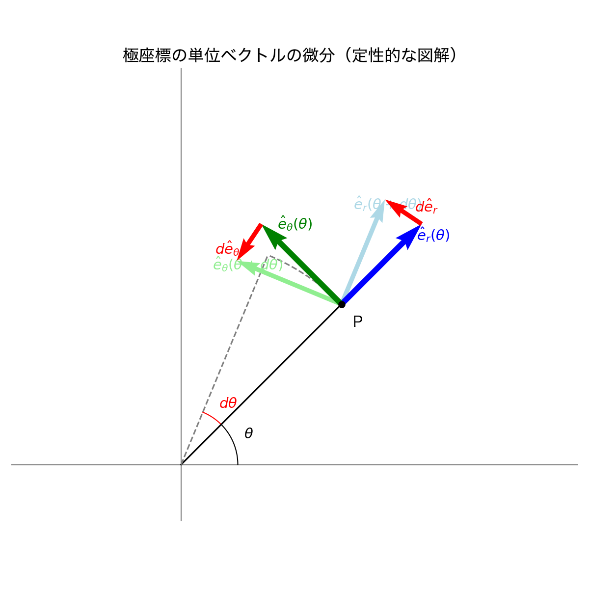

# はじめに {.unnumbered}

このノートは、物理学基礎論A（力学）の講義内容を、理論体系およびシミュレーション学習の観点から再構成するための作業文書です。
定義・定理・証明・計算例、そしてそれらを検証するためのシミュレーションコードを優先して整理します。

# 導入と記法 {#intro-notation}

ここでは力学で用いるベクトル解析、微分方程式の記法などを整理します。

## 極座標系と基底ベクトルの微分 {#polar-coordinates}

平面の極座標 $(r, \theta)$ では、位置ベクトル $\vec{r}$ は以下のように表されます。
$$ \vec{r} = r \hat{e}_r $$
ここで、$\hat{e}_r$ は動径方向の単位ベクトルです。また、これに直交し反時計回りを正とする方向の単位ベクトルを $\hat{e}_\theta$ とします。

直交座標系 (デカルト座標) の基底ベクトル $\hat{i}, \hat{j}$ は時間や位置によらず一定ですが、極座標の基底ベクトル $\hat{e}_r, \hat{e}_\theta$ は **質点の位置（角度 $\theta$）に依存して向きが変わる** ため、時間微分するとゼロにはなりません。

以下の図は、角度が $\theta$ から $\theta + d\theta$ へ微小に変化したときの基底ベクトルの変化 $d\hat{e}_r, d\hat{e}_\theta$ を示しています。

{#fig-polar-vectors width=60%}

図から定性的に以下のことが分かります：
1. **$d\hat{e}_r$ の向き**: $\hat{e}_r$ が $d\theta$ だけ回転すると、その変化分 $d\hat{e}_r$ は元のベクトルと直交する方向、すなわち $\hat{e}_\theta$ の方向を向きます。長さは $1 \cdot d\theta$ となります。
2. **$d\hat{e}_\theta$ の向き**: $\hat{e}_\theta$ が $d\theta$ だけ回転すると、その変化分 $d\hat{e}_\theta$ は元のベクトルと直交する方向ですが、$\hat{e}_r$ とは逆向き（中心に向かう方向）となります。長さは $1 \cdot d\theta$ となります。

これを時間 $dt$ で割ることで、時間微分の公式が得られます：
$$ \frac{d\hat{e}_r}{dt} = \dot{\theta} \hat{e}_\theta, \quad \frac{d\hat{e}_\theta}{dt} = -\dot{\theta} \hat{e}_r $$

これらは速度と加速度の極座標成分を計算する上で最も重要な関係式です。

# 質点の力学 {#particle-mechanics}

ニュートンの運動方程式、保存則、振動現象などを扱います。

# 剛体の力学 {#rigid-body}

剛体の回転運動、慣性テンソル、オイラー方程式などを扱います。

# 解析力学 {#analytical-mechanics}

最小作用の原理、ラグランジュ形式、ハミルトン形式などを扱います。
