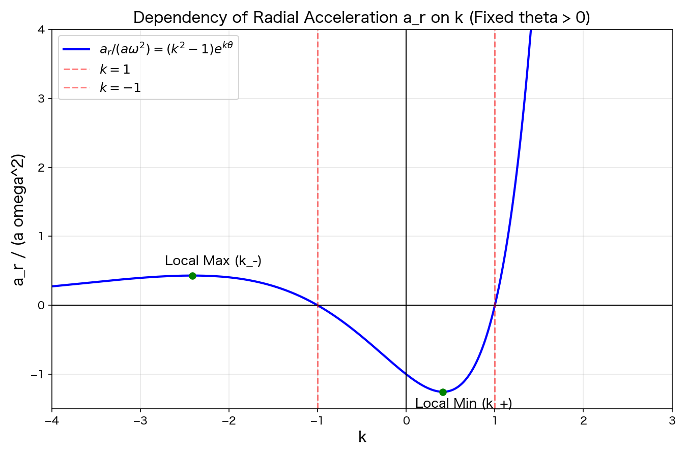

## 問題

等角螺旋 $r = ae^{k\theta} \ (\theta > 0)$ の上を、角速度 $\dot{\theta} = \omega = \text{const}$ で運動する点があります。
この点の速度と加速度の極座標成分 $v_r, v_\theta, a_r, a_\theta$ を求めよ。

また、$a > 0$ のとき、求めた加速度の動径成分 $a_r$ が $k$ に対してどのように変化するか、定性的なグラフと共に簡潔に説明せよ。

---

## インタラクティブ・シミュレーション

螺旋上の質点の動きをイメージするためのシミュレーションです。スライダーを動かして、パラメータ $k$ が軌道にどう影響するか確認してください。

```{shinylive-python}
#| standalone: true
#| components: [editor, viewer]

import numpy as np
import matplotlib.pyplot as plt
from shiny import App, render, ui

# --- UI（ユーザーインターフェース）の定義 ---
app_ui = ui.page_fluid(
    ui.layout_sidebar(
        ui.sidebar(
            ui.input_slider("k", "パラメータ k", -0.5, 0.5, 0.15, step=0.05),
            ui.input_slider("omega", "角速度 ω", 0.5, 5.0, 1.5, step=0.1),
            ui.input_slider("t", "時間 t (s)", 0.0, 5.0, 0.0, step=0.1, 
                            animate=ui.AnimationOptions(interval=100, loop=True))
        ),
        ui.output_plot("spiral_plot"),
    )
)

# --- サーバー（計算ロジック）の定義 ---
def server(input, output, session):
    @render.plot(alt="等角螺旋のシミュレーション")
    def spiral_plot():
        k = input.k()
        omega = input.omega()
        t = input.t()
        a = 1.0 # スケール係数
        
        # 軌跡を描画するための細かい角度配列
        # 時間が進むにつれて角度の最大値が増え、軌道が伸びる
        theta_max = omega * t
        if theta_max == 0:
            theta_max = 0.01 # 描画エラー回避
            
        theta_array = np.linspace(0, theta_max, 200)
        
        # 極座標 (r, theta) から直交座標 (x, y) への変換
        r_array = a * np.exp(k * theta_array)
        x_array = r_array * np.cos(theta_array)
        y_array = r_array * np.sin(theta_array)
        
        # 現在時刻の質点の位置
        x_current = x_array[-1]
        y_current = y_array[-1]
        
        # --- 描画処理 ---
        fig, ax = plt.subplots(figsize=(6, 6))
        
        # 最大半径を計算してグラフの描画枠を固定する
        max_r = max(a, a * np.exp(k * omega * 5.0))
        ax.set_xlim(-max_r*1.1, max_r*1.1)
        ax.set_ylim(-max_r*1.1, max_r*1.1)
        ax.set_aspect('equal')
        ax.grid(True, linestyle='--', alpha=0.7)
        ax.set_title(f"等角螺旋の軌道 (時間 t = {t:.1f})")
        
        # 軌跡の描画
        ax.plot(x_array, y_array, 'k-', alpha=0.5, label='軌跡')
        # 動径ベクトルの描画
        ax.plot([0, x_current], [0, y_current], 'b-', lw=1.5, label='動径ベクトル $\\vec{r}$')
        # 質点の描画
        ax.plot(x_current, y_current, 'ro', markersize=8)
        
        ax.legend(loc='upper left')
        return fig

# アプリの起動
app = App(app_ui, server)
```

---

## 解答と計算過程の解説

### 1. 速度と加速度の極座標成分の公式の導出（復習）

まず、極座標系における基底ベクトルの微分の性質（詳細は [理論体系ノートの極座標系のセクション](../../textbook.qmd#polar-coordinates) を参照してください）から出発します。
位置ベクトル $\vec{r} = r \hat{e}_r$ を時間 $t$ で微分します。ここで関数の積を微分する**積の微分公式** $(AB)' = A'B + AB'$ を用います。

$$ \vec{v} = \frac{d\vec{r}}{dt} = \frac{d}{dt}(r \hat{e}_r) = \dot{r} \hat{e}_r + r \dot{\hat{e}}_r $$

前述のノートで確認したように、基底ベクトルが時間とともに回転するため $\dot{\hat{e}}_r = \dot{\theta} \hat{e}_\theta$ となります。これを代入すると、
$$ \vec{v} = \dot{r} \hat{e}_r + r \dot{\theta} \hat{e}_\theta $$
したがって、速度成分は $v_r = \dot{r}, v_\theta = r\dot{\theta}$ となります。

さらにこれをもう一度微分して加速度を求めます。3つの積の微分 $(ABC)' = A'BC + AB'C + ABC'$ も使います。
$$ \vec{a} = \frac{d\vec{v}}{dt} = \frac{d}{dt}(\dot{r} \hat{e}_r) + \frac{d}{dt}(r \dot{\theta} \hat{e}_\theta) $$
$$ = (\ddot{r} \hat{e}_r + \dot{r} \dot{\hat{e}}_r) + (\dot{r} \dot{\theta} \hat{e}_\theta + r \ddot{\theta} \hat{e}_\theta + r \dot{\theta} \dot{\hat{e}}_\theta) $$

ここで $\dot{\hat{e}}_r = \dot{\theta} \hat{e}_\theta$ と $\dot{\hat{e}}_\theta = -\dot{\theta} \hat{e}_r$ を代入して整理すると、
$$ \vec{a} = (\ddot{r} - r\dot{\theta}^2)\hat{e}_r + (r\ddot{\theta} + 2\dot{r}\dot{\theta})\hat{e}_\theta $$
これが加速度の極座標成分 $a_r, a_\theta$ の公式です。

### 2. 本問の計算過程

問題の条件より、以下の関係式が与えられています。
*   $r = ae^{k\theta}$
*   $\dot{\theta} = \omega \quad (\text{一定})$
*   $\ddot{\theta} = \frac{d}{dt}(\omega) = 0$

まず、$r$ の時間微分 $\dot{r}$ を計算します。ここでも**合成関数の微分法則**（チェインルール）を用います。
$\theta$ は時間 $t$ の関数であるため、$r(t) = a e^{k\theta(t)}$ を $t$ で微分するには、一度全体を $\theta$ で微分してから中身の微分 $\dot{\theta}$ を掛けます。
$$ \dot{r} = \frac{dr}{d\theta} \cdot \frac{d\theta}{dt} = \frac{d}{d\theta}(ae^{k\theta}) \cdot \omega = (ake^{k\theta}) \cdot \omega = ak\omega e^{k\theta} $$
ここで、$ae^{k\theta} = r$ であることに着目すると、
$$ \dot{r} = k\omega r $$
とスッキリ書くこともできます。

さらに、もう一度時間微分して $\ddot{r}$ を求めます。**定数倍の微分** $\frac{d}{dt}(C \cdot f(t)) = C \cdot \dot{f}(t)$ に注意して、積の公式を使わずに計算します。
$$ \ddot{r} = \frac{d}{dt}(k\omega r) = k\omega \cdot \dot{r} $$
先ほど求めた $\dot{r} = ak\omega e^{k\theta}$ を代入すると、
$$ \ddot{r} = k\omega (ak\omega e^{k\theta}) = ak^2\omega^2 e^{k\theta} $$

これらを先ほど復習した公式に代入して、各成分を求めます。

**速度成分:**
$$ v_r = \dot{r} = \boldsymbol{ak\omega e^{k\theta}} $$
$$ v_\theta = r\dot{\theta} = (ae^{k\theta})\omega = \boldsymbol{a\omega e^{k\theta}} $$

**加速度成分:**
$$ a_r = \ddot{r} - r\dot{\theta}^2 = ak^2\omega^2 e^{k\theta} - (ae^{k\theta})\omega^2 = \boldsymbol{a\omega^2(k^2 - 1)e^{k\theta}} $$
$$ a_\theta = r\ddot{\theta} + 2\dot{r}\dot{\theta} = (ae^{k\theta})(0) + 2(ak\omega e^{k\theta})\omega = \boldsymbol{2ak\omega^2 e^{k\theta}} $$

---

### 3. 加速度の動径成分 $a_r$ の $k$ に対する依存性

求めた動径加速度は $a_r(k) = a\omega^2(k^2 - 1)e^{k\theta}$ です。
$a > 0$ かつ $\theta > 0$ を固定した場合に、この値がパラメータ $k$ によってどのように変化するかを考察します。定数部分 $a\omega^2 > 0$ なので、関数 $f(k) = (k^2 - 1)e^{k\theta}$ の振る舞いを調べればよいことになります。

微分して極値を求めます。ここでも積の微分公式を用いています。
$$ f'(k) = 2ke^{k\theta} + (k^2 - 1) \cdot \theta e^{k\theta} = (\theta k^2 + 2k - \theta)e^{k\theta} $$
$f'(k) = 0$ となる $k$ は、2次方程式 $\theta k^2 + 2k - \theta = 0$ の解であり、解の公式より
$$ k_{\pm} = \frac{-1 \pm \sqrt{1 + \theta^2}}{\theta} $$
となります。$\theta > 0$ のため、$k_+ > 0$（極小値を与える）、$k_- < -1$（極大値を与える）となります。

以下が、その定性的なグラフです。



#### グラフから読み取れる物理的・定性的な振る舞い

1.  **$a_r$ の符号（力の向き）**:
    $e^{k\theta}$ は常に正なので、$a_r$ の符号は $(k^2 - 1)$ だけで決まります。
    *   **$|k| < 1$ のとき**: $a_r < 0$ となり、質点は原点に向かって引かれるような実効的な力（向心力）を感じます。
    *   **$|k| > 1$ のとき**: $a_r > 0$ となり、遠心力が勝り、原点から遠ざかる方向へ加速（斥力）します。
    *   **$k = \pm 1$ のとき**: $a_r = 0$ となり、動径方向の力と遠心力が釣り合って、動径方向の加速度を持たなくなります。
2.  **$k \to \infty$ のとき**: 
    指数関数 $e^{k\theta}$ が爆発的に増加するため、正の無限大に発散します。
3.  **$k \to -\infty$ のとき**: 
    $(k^2 - 1)$ は大きくなりますが、指数関数 $e^{k\theta}$ が $0$ へ急激に減衰する効果が勝るため、$a_r \to 0$ へと漸近します（螺旋が急激に原点に巻き込まれるため、速度自体が急速に0に近づくためです）。
4.  **極値の存在**:
    $k < -1$ の領域にただ一つの極大値（正の値）を持ち、$0 < k < 1$ の領域にただ一つの極小値（負の値）を持ちます。
